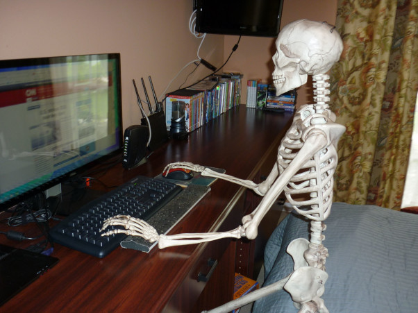

# 09/28/2026

## It's been Awhile
As with most people, life happens. Not a day has gone by that I haven't thought about my website, and Markerator. I always intend to update them.

Not to complain, but this has been the most difficult year of my entire life. I was laid off from my job at the end of February, and have been trying to hustle to find another one ever since. You'd think this would give me copious amounts of time to work on coding projects, but that turns out to not be the case. I've probably never been busier in my life. There are countless things I'd been putting off because we had been in *"crunch mode"* at work for nearly a year.

### Projects
I finished building a massive, floor to ceiling, entertainment center in our great room. By far one of the most complicated wood working projects I've ever done.

I *re-finished* the treehoue that the kids and I built last year. This included installing a small woodstove, and adding indoor/outdoor carpet to the floor, as well as finishing up a bunch of trim. Speaking of which, we had a nasty windstorm blow through a few weeks ago, and a dead tree nearly took the treehouse out.

I've also spent a ton of time cutting up and splitting wood for out woodstove for the winter. This includes the aforementioned tree that nearly took out the treehoue. Our 10 acres is mostly wooded, but it's fairly difficult to find trees that are a good fit to be cut down. The one I cut up this year was nearly 100 feet tall.

My truck has needed a ton of work done to it this year. And that has taken up a bunch of time as well.

And finally, I try to spend an hour or two every single day doing a *"work related"* programming project or training course to keep my skills sharp. I've also been trying to learn new things along the way. This includes languages that I don't necessarily love, but I can see which way the windows are blowing. This includes Python and Rust...ugh. I've become one of them ;P

## Conclusion
Going forward, I'm going to try to get back to my personal programming projects more often, including Markerator, as well as a small game project that I've been poking around at. Until next time..